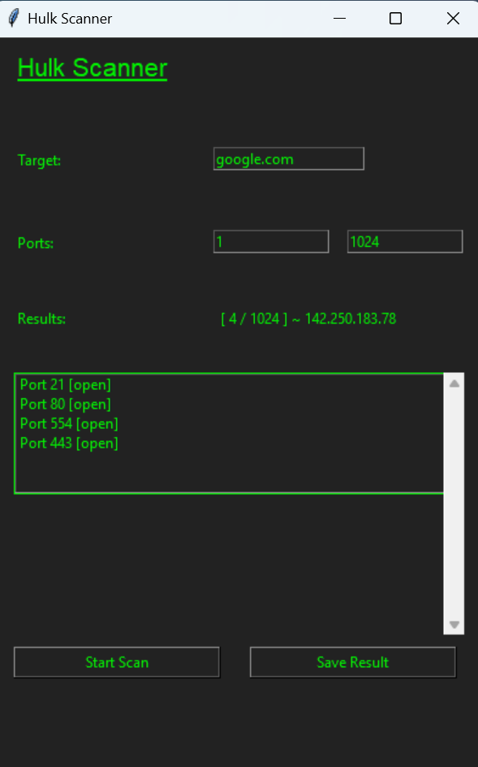
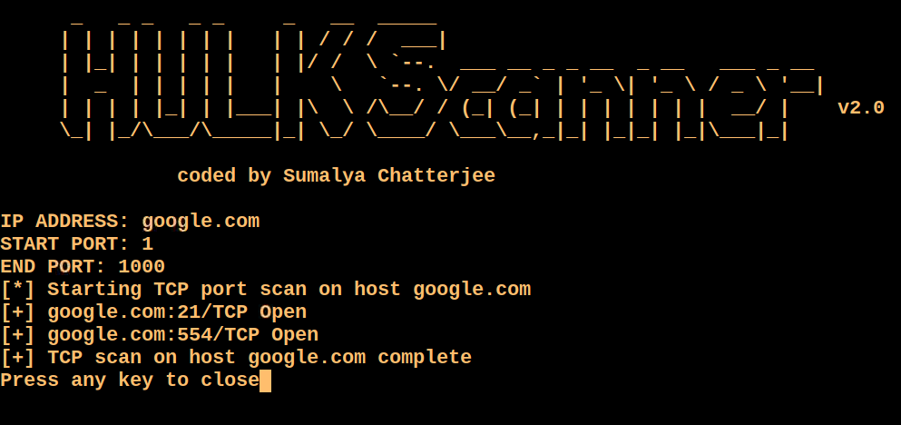

# HULKSCANNER
# <div align="center">|👾| Hulk Scanner |👾|</div> 


##
## Hulkscanner-gui output :

## Hulkscanner output :

## Hulk scanner is basically a portscanner available for all oses. Softwares are coded for different enviroments. If any software can't run, that's not meant for software's fault, just go for another version. 
##
## Git Installation :
```
# Clone the repo
git clone https://github.com/R3DHULK/HulkScanner
# Change Directory
cd HulkScanner
# Install Requirements
pip install -r requirements.txt
# Run The Programme
python <whatever program you wanna run>
```
## 
#
[!] Don't Use for revenges
##
<h3 align="left">Support:</h3>
<p><a href="https://www.buymeacoffee.com/https://www.buymeacoffee.com/r3dhulk"> </a></p><br><br>
